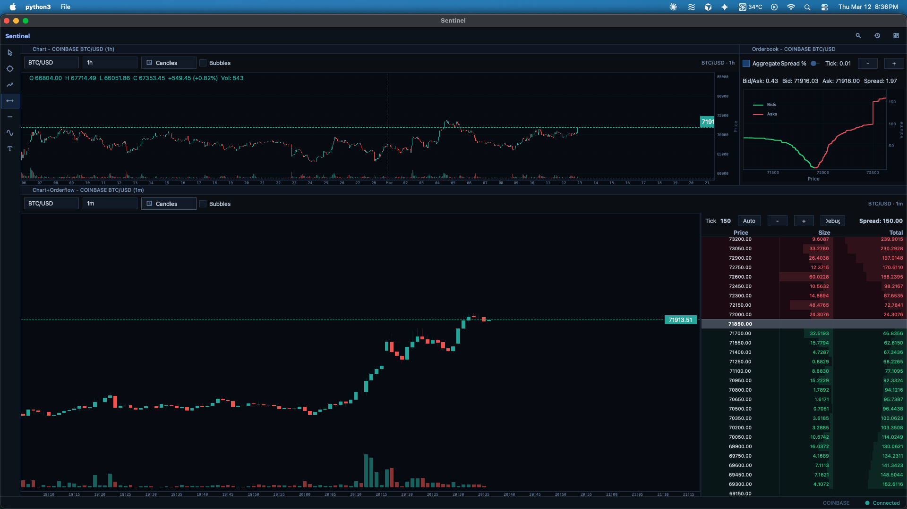

# Sentinel

Sentinel is a desktop trading workstation built with `PySide6`, `PyQtGraph`, and `qasync`.

Current focus:
- live charting
- chart + orderflow composite view
- DOM and depth/orderbook tooling
- dockable Qt workspace with layout persistence
- shared async market-data runtime



## Quick Start

### 1. Install dependencies

```bash
uv sync --group dev
```

### 2. Run the app

```bash
uv run python -m sentinel
```

### 3. Run tests

```bash
uv run python -m pytest
```

## Current Workspace Model

Sentinel is a dock-based workspace.

Primary active widgets:
- `Chart`
- `Chart + Orderflow`
- `DOM`
- `Orderbook`

Important behavior:
- each chart widget owns its own `Symbol`, `Timeframe`, `Mode`, and `Bubbles` state
- chart and chart+orderflow widgets do not share market controls globally
- layout and widget state persist across restarts when the saved layout version matches

## Architecture At A Glance

- `sentinel/app`
  - Qt shell
  - main window
  - layout persistence
  - widget registry
  - runtime/signal bridge
- `sentinel/widgets`
  - chart panes and dock widgets
  - chart-local toolbars
  - chart+orderflow composite
  - DOM and orderbook widgets
- `sentinel/core`
  - streaming runtime
  - task management
  - exchange/data access
  - signals
  - cache/fetch infrastructure
- `sentinel/analysis`
  - shared analytics and processors
  - orderbook aggregation / ladder helpers

## Runtime Notes

- Sentinel uses `qasync` and the external Qt event loop path.
- High-frequency widgets use internal dirty-state models plus capped timer-based rendering.
- Rendering should not be driven directly by per-tick Qt signal spam.

## Development Notes

- Dependencies are managed in `pyproject.toml`
- Use `uv`
- The active app is `sentinel`
- `sentinel_ops/` is legacy and not part of the active product direction

## Validation

Useful checks:

```bash
uv run python -c "import sentinel, sentinel.app.runtime, sentinel.core.facade"
uv run python -m pytest
```

## Project Guidance

Contributor and agent operating guidance lives in `AGENTS.md`.

## Tiny Daily Note

- 2026-03-15: README touch-up + project heartbeat check ✅

## License

MIT. See `LICENSE`.
