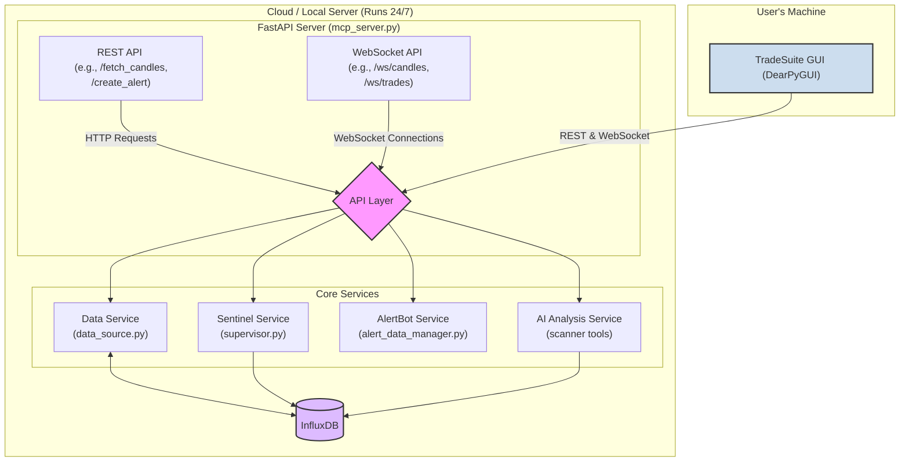

# Blueprint: AI & Sentinel Integration into a Client-Server Architecture

This document outlines the architectural blueprint and phased implementation plan for evolving TradeSuite from a monolithic application into a distributed client-server system. The goal is to enable 24/7 data collection and AI-driven analysis while maintaining a responsive, lightweight GUI.

---

### 🗺️ **Proposed Architecture**

The core of the new architecture is the separation of concerns between a persistent, powerful server and a lightweight, user-facing client. The server handles all heavy lifting, including data collection, analysis, and alert monitoring, while the client is responsible only for rendering data and forwarding user actions.

### 🔁 **Server-Side Responsibilities**

The server, built upon the `mcp_server.py` FastAPI application, will be the central hub.

-   **Continuous Data Collection:** The `Sentinel` service will run as a background task, collecting and storing BTC microstructure data into InfluxDB 24/7.
-   **On-Demand Data:** The `Data` service will fetch historical and real-time data for other assets as requested by clients.
-   **Alert Monitoring:** The `AlertBot` service will run as a background task, continuously evaluating user-defined alert conditions.
-   **AI Analysis:** The `scanner` tools will be integrated and exposed via a dedicated API endpoint (`/explain_price_action`), allowing the AI to perform complex analysis on server-side data.
-   **API Gateway:** It will expose all functionality through a secure and well-defined set of REST and WebSocket endpoints.

### 📡 **Client Role: The Lightweight GUI**

The DearPyGUI application will be refactored into a "thin client."

-   **No Direct Data Connections:** The client will no longer instantiate the `DataSource` or connect to exchanges directly.
-   **API Communication:** It will communicate exclusively with the server via the WebSocket and REST APIs to subscribe to data streams and trigger actions.
-   **Rendering and User Input:** Its sole responsibility is to render the data it receives from the server and send user commands (e.g., "create alert," "analyze this chart") to the appropriate server endpoint.

---

### 🔧 **Phased Implementation Plan**

This migration is broken down into three distinct phases, allowing for incremental development and testing.

#### **Phase 1: Solidify the Server Foundation**

*Goal: Create a standalone, runnable server that manages all background services.*

-   [ ] **Task 1.1: Finalize Service Integration:**
    -   **Action:** In `mcp_server.py`, replace the dummy objects with your actual `InfluxDB`, `Sentinel`, and `AlertBot` classes.
    -   **Details:** Adjust import paths and ensure they are initialized correctly within the `lifespan_manager`. The `Sentinel` and `AlertBot` should be started as background tasks using `asyncio.create_task()`.

-   [ ] **Task 1.2: Build Alert Management REST Endpoints:**
    -   **Action:** Implement the API endpoints for managing alerts.
    -   **Endpoints:**
        -   `POST /alerts`: Creates a new alert rule on the server.
        -   `GET /alerts`: Lists currently active alerts.
        -   `DELETE /alerts/{alert_id}`: Removes an existing alert.

-   [ ] **Task 1.3: Build Real-Time WebSocket Endpoints:**
    -   **Action:** Create WebSocket endpoints to stream live data to clients.
    -   **Endpoints:**
        -   `/ws/trades/{exchange}/{symbol}`: Forwards live trades from the `Data` service.
        -   `/ws/candles/{exchange}/{symbol}/{timeframe}`: Forwards updating candles.
        -   `/ws/notifications`: A central channel where the `AlertBot` can push triggered alert notifications.

#### **Phase 2: Refactor the GUI Client**

*Goal: Decouple the GUI from data management and connect it to the server.*

-   [ ] **Task 2.1: Create a Dedicated API Client Module:**
    -   **Action:** Inside the `trade_suite` package, create a new file (e.g., `api_client.py`).
    -   **Details:** This module will contain wrapper functions that handle the communication logic for `httpx` (REST) and `websockets`. This centralizes API interaction and keeps the GUI code clean.

-   [ ] **Task 2.2: Replace Direct Data Access with API Calls:**
    -   **Action:** Systematically go through the GUI codebase.
    -   **Details:** Replace all instances of `data_source.fetch...` or `data_source.watch...` with calls to the new functions in `api_client.py`.

-   [ ] **Task 2.3: Adapt UI for Server-Side State:**
    -   **Action:** Modify UI components to reflect the new client-server dynamic.
    -   **Example:** An "Alerts" window should now fetch its list of alerts from `GET /alerts` and use `POST /alerts` to create new ones, rather than managing them locally.

#### **Phase 3: Activate AI and Prepare for Deployment**

*Goal: Integrate the AI analysis capabilities and package the server for deployment.*

-   [ ] **Task 3.1: Implement the AI/Scanner Logic:**
    -   **Action:** Flesh out the `/explain_price_action` endpoint in `mcp_server.py`.
    -   **Details:** Replace the current dummy implementation with real calls to your `scanner` tools. The flow should be: 1) fetch data using `data_service`, 2) query `sentinel_service` for BTC context, 3) execute the scanner analysis, 4) return the synthesized explanation.

-   [ ] **Task 3.2: Document and Containerize:**
    -   **Action:** Prepare the server for easy and repeatable deployment.
    -   **Details:**
        -   FastAPI's `/docs` page provides automatic API documentation. Add descriptions to your models and endpoints to enhance it.
        -   Create a `Dockerfile` for the server application.
        -   Create a `docker-compose.yml` file to orchestrate running the FastAPI server and its primary dependency, InfluxDB, with a single command.

---

### ☁️ **Server & Hosting Requirements**

-   **CPU & Memory:**
    -   **Baseline:** For `Sentinel` (monitoring one asset, BTC/USD) and the `AlertBot` with a handful of rules, a server with **1-2 vCPUs** and **2-4 GB of RAM** should be sufficient.
    -   **AI Usage:** The `scanner` and LLM tools are the most resource-intensive components. If you plan to run frequent, complex analyses, especially with local models, you will need to scale up. A machine with **4+ vCPUs** and **8-16+ GB of RAM** would be a safer starting point. GPU access would be necessary for running larger local models efficiently.

-   **Free Tier Viability:**
    -   **Can it run on a free tier?** **Yes, for initial development and testing.**
    -   **Providers:**
        -   **Oracle Cloud:** Their "Always Free" tier is generous, often providing up to 2-4 ARM vCPUs and 24 GB of RAM, which is more than enough to get started.
        -   **AWS (EC2 t2.micro/t3.micro), Google Cloud (e2-micro):** These free tiers typically offer 1-2 vCPUs and 1-2 GB of RAM. This will be **tight**. It can likely run the baseline server, but you may experience slowdowns, especially if memory usage for data streams spikes. Running AI analysis on these tiers will be very slow or impossible.
    -   **Recommendation:** Start with Oracle Cloud's free tier if possible. Otherwise, use the AWS/GCP free tiers for basic testing of the server foundation (Phase 1), but plan to move to a paid, more powerful instance (e.g., ~$10-30/month) for Phase 3 and production use.

-   **Storage:**
    -   InfluxDB storage for `Sentinel` (trades and order book data for one asset) is manageable. A few GB per month is a reasonable estimate, but this will grow over time. Ensure your host has at least **25-50 GB of block storage** available.