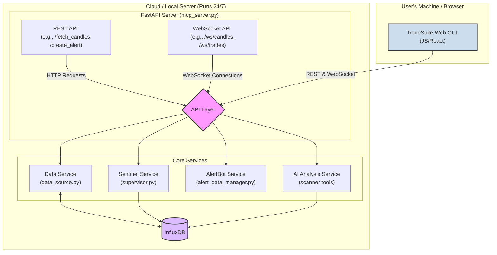

# Blueprint: TradeSuite v2 - Full System Architecture

This document outlines the architectural blueprint and phased implementation plan for evolving TradeSuite into a distributed client-server system. It covers both the 24/7 backend services and the migration to a modern, web-based frontend.

**Part 1: Backend & Server-Side Architecture**

### 🗺️ **Proposed Backend Architecture**

The core of the new architecture is a persistent, powerful Python server that handles all heavy lifting, including data collection, analysis, and alert monitoring.

### 🔁 **Server-Side Responsibilities**

The server, built upon the `mcp_server.py` FastAPI application, will be the central hub.

-   **Continuous Data Collection:** The `Sentinel` service will run as a background task, collecting and storing BTC microstructure data into InfluxDB 24/7.
-   **On-Demand Data:** The `Data` service will fetch historical and real-time data for other assets as requested by clients.
-   **Alert Monitoring:** The `AlertBot` service will run as a background task, continuously evaluating user-defined alert conditions.
-   **AI Analysis:** The `scanner` tools will be integrated and exposed via a dedicated API endpoint (`/explain_price_action`), allowing the AI to perform complex analysis on server-side data.
-   **API Gateway:** It will expose all functionality through a secure and well-defined set of versioned REST and WebSocket endpoints.

---

**Part 2: Frontend Architecture & Migration Plan**

### 📡 **Frontend Goal & Architecture**

The existing DearPyGui application will be replaced by a modern, web-based user interface built with a standard JavaScript framework (e.g., React) to achieve a sophisticated, performant, and maintainable UI.

-   **Thin Client:** The frontend is purely a presentation layer. It makes no direct connections to exchanges and runs no persistent background tasks.
-   **API Communication:** It communicates exclusively with the Python backend via the versioned REST and WebSocket APIs.
-   **Key Technologies:**
    -   **Framework:** React+Vite is recommended.
    -   **Styling:** Tailwind CSS.
    -   **Charting:** TradingView Lightweight Charts.
    -   **Layout:** A flexible docking/tiling layout system (e.g., Golden Layout).

### 🔧 **Unified Implementation Plan (Backend & Frontend)**

This migration is broken down into integrated phases.

#### **Phase 1: Foundation & Chart MVP**

*Goal: Establish the core server and render the first live widget in the new web UI.*

-   [ ] **Task 1.1 (Backend): Finalize Service Integration:** In `mcp_server.py`, replace dummy objects with actual `InfluxDB`, `Sentinel`, and `AlertBot` classes. Ensure they start correctly via the `lifespan_manager`.
-   [ ] **Task 1.2 (Backend): Define & Implement Charting API:**
    -   **Action:** Define Pydantic schemas for candle history (REST) and live candle updates (WebSocket).
    -   **Endpoints:** Implement `GET /api/v1/candles` and `/ws/v1/candles/{...}`.
-   [ ] **Task 1.3 (Frontend): Scaffold Project:** Set up a React+Vite project with TypeScript, Tailwind CSS, and other essential tools.
-   [ ] **Task 1.4 (Frontend): Implement Chart MVP:** Create a basic TradingView Lightweight Chart component that fetches initial history via REST and subscribes to the WebSocket for live updates.

#### **Phase 2: Modular Widgets & Core Features**

*Goal: Expand the UI with more widgets and essential features like alerts.*

-   [ ] **Task 2.1 (Backend): Build Alert Management API:** Implement REST endpoints for creating, listing, and deleting alerts (`POST`, `GET`, `DELETE` at `/api/v1/alerts`).
-   [ ] **Task 2.2 (Backend): Build Real-Time Trade/Order Book API:** Define schemas and implement WebSocket endpoints for streaming trades and order book data. Consider binary encoding (MsgPack) for performance.
-   [ ] **Task 2.3 (Frontend): Implement Docking Layout:** Integrate the chosen docking/tiling layout manager (e.g., Golden Layout).
-   [ ] **Task 2.4 (Frontend): Build Order Book & Trade Tape Widgets:** Create the components for displaying real-time order book depth and time & sales, connecting them to the new WebSocket streams.
-   [ ] **Task 2.5 (Frontend): Build Alert Management UI:** Create a UI for users to manage their alerts by interacting with the alert API endpoints.

#### **Phase 3: AI Integration & Deployment**

*Goal: Integrate the AI analysis capabilities and package the application for deployment.*

-   [ ] **Task 3.1 (Backend): Implement AI Analysis Endpoint:** Flesh out the `POST /api/v1/explain_price_action` endpoint with the real `scanner` tool logic.
-   [ ] **Task 3.2 (Frontend): Integrate AI Features:** Create a UI element that allows a user to request a price action explanation, call the AI endpoint, and display the results.
-   [ ] **Task 3.3 (DevOps): Document & Containerize:** Create a `Dockerfile` for the server and a `docker-compose.yml` to orchestrate running the FastAPI server and InfluxDB together.

---

### ☁️ **Server & Hosting Requirements**

-   **CPU & Memory:**
    -   **Baseline:** For `Sentinel` (monitoring one asset, BTC/USD) and the `AlertBot` with a handful of rules, a server with **1-2 vCPUs** and **2-4 GB of RAM** should be sufficient.
    -   **AI Usage:** The `scanner` and LLM tools are the most resource-intensive components. If you plan to run frequent, complex analyses, especially with local models, you will need to scale up. A machine with **4+ vCPUs** and **8-16+ GB of RAM** would be a safer starting point. GPU access would be necessary for running larger local models efficiently.

-   **Free Tier Viability:**
    -   **Can it run on a free tier?** **Yes, for initial development and testing.**
    -   **Providers:**
        -   **Oracle Cloud:** Their "Always Free" tier is generous, often providing up to 2-4 ARM vCPUs and 24 GB of RAM, which is more than enough to get started.
        -   **AWS (EC2 t2.micro/t3.micro), Google Cloud (e2-micro):** These free tiers typically offer 1-2 vCPUs and 1-2 GB of RAM. This will be **tight**. It can likely run the baseline server, but you may experience slowdowns, especially if memory usage for data streams spikes. Running AI analysis on these tiers will be very slow or impossible.
    -   **Recommendation:** Start with Oracle Cloud's free tier if possible. Otherwise, use the AWS/GCP free tiers for basic testing of the server foundation (Phase 1), but plan to move to a paid, more powerful instance (e.g., ~$10-30/month) for Phase 3 and production use.

-   **Storage:**
    -   InfluxDB storage for `Sentinel` (trades and order book data for one asset) is manageable. A few GB per month is a reasonable estimate, but this will grow over time. Ensure your host has at least **25-50 GB of block storage** available.