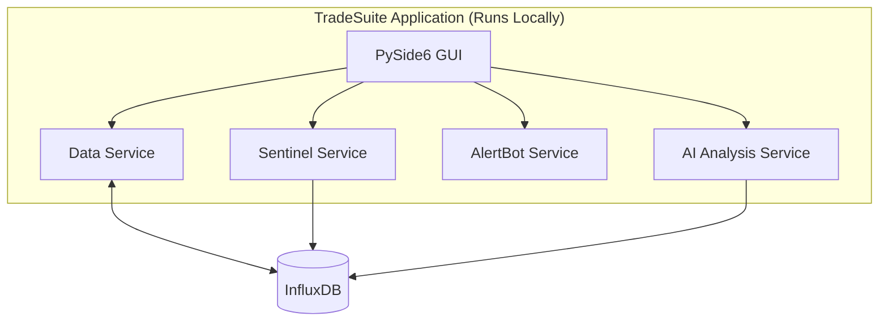

# Blueprint: TradeSuite v2 - Full System Architecture

This document outlines the blueprint for TradeSuite v2. The new approach abandons the previous client/server split and instead keeps everything in a single Python application. The frontend will be rewritten using **PySide6**, while existing background services continue to run inside the same process.

**Part 1: Backend & Server-Side Architecture**

### 🗺️ **Proposed Backend Architecture**

The application continues to provide 24/7 data collection and analysis, but all components run locally.

### 🔁 **Background Service Responsibilities**

The application orchestrates several background services that run alongside the PySide6 GUI.

-   **Continuous Data Collection:** The `Sentinel` service will run as a background task, collecting and storing BTC microstructure data into InfluxDB 24/7.
-   **On-Demand Data:** The `Data` service will fetch historical and real-time data for other assets as requested by clients.
-   **Alert Monitoring:** The `AlertBot` service will run as a background task, continuously evaluating user-defined alert conditions.
-   **AI Analysis:** The `scanner` tools provide in-process price action explanations and other advanced analytics.

---

**Part 2: Frontend Architecture & Migration Plan**

### 📡 **Frontend Goal & Architecture**

The existing DearPyGui interface will be ported to **PySide6**, retaining a native desktop experience while leveraging Qt's rich widget ecosystem.

-   **Integrated Application:** The GUI lives in the same Python process as the data and alert services.
-   **Key Technologies:**
    -   **Framework:** PySide6 (Qt for Python)
    -   **Charting:** Existing widgets adapted to Qt's painting system
    -   **Layout:** Qt's docking widgets or a custom docking implementation

### 🔧 **Unified Implementation Plan (Backend & Frontend)**

This migration is broken down into integrated phases.

#### **Phase 1: Foundation & Chart MVP**

*Goal: Establish the PySide6 framework and render the first live widget.*

-   [ ] **Task 1.1 (Frontend): Scaffold PySide6 Project:** Create the main window and application skeleton.
-   [ ] **Task 1.2 (Frontend): Port Chart Widget:** Adapt the existing chart widget to PySide6 and connect it directly to the `Data` service.
-   [ ] **Task 1.3 (Backend): Start Services:** Ensure `Sentinel` and `AlertBot` start alongside the GUI.

#### **Phase 2: Modular Widgets & Core Features**

*Goal: Expand the GUI with additional widgets and alert management.*

-   [ ] **Task 2.1 (Frontend): Implement Docking Layout:** Use Qt docking widgets or a suitable library for a flexible layout.
-   [ ] **Task 2.2 (Frontend): Port Order Book & Trade Tape Widgets:** Adapt these widgets to PySide6 and wire them to the live data streams.
-   [ ] **Task 2.3 (Frontend): Build Alert Management Dialog:** Allow users to create and manage alerts using the in-process `AlertBot` service.

#### **Phase 3: AI Integration & Deployment**

*Goal: Integrate the AI analysis capabilities and package the application for deployment.*

-   [ ] **Task 3.1 (Frontend): Integrate AI Features:** Add a dialog that invokes the `scanner` tools to generate price action explanations.
-   [ ] **Task 3.2 (DevOps): Package Application:** Use PyInstaller (or similar) to build cross-platform executables and document the build process.

---

### ☁️ **System Requirements**

-   **CPU & Memory:**
    -   **Baseline:** Running `Sentinel` (monitoring one asset, BTC/USD) and the `AlertBot` alongside the GUI requires **1-2 vCPUs** and **2-4 GB of RAM**.
    -   **AI Usage:** The `scanner` and LLM tools are the most resource-intensive components. If you plan to run frequent, complex analyses, especially with local models, you will need to scale up. A machine with **4+ vCPUs** and **8-16+ GB of RAM** would be a safer starting point. GPU access would be necessary for running larger local models efficiently.

-   **Free Tier Viability:**
    -   **Can it run on a free tier?** **Yes, for initial development and testing.**
    -   **Providers:**
        -   **Oracle Cloud:** Their "Always Free" tier is generous, often providing up to 2-4 ARM vCPUs and 24 GB of RAM, which is more than enough to get started.
        -   **AWS (EC2 t2.micro/t3.micro), Google Cloud (e2-micro):** These free tiers typically offer 1-2 vCPUs and 1-2 GB of RAM. This will be **tight**. It can likely run the baseline server, but you may experience slowdowns, especially if memory usage for data streams spikes. Running AI analysis on these tiers will be very slow or impossible.
    -   **Recommendation:** Cloud VMs can be used, but a modest local machine is also sufficient for development. Scale up if heavy AI usage is planned.

-   **Storage:**
    -   InfluxDB storage for `Sentinel` (trades and order book data for one asset) is manageable. A few GB per month is a reasonable estimate, but this will grow over time. Ensure your host has at least **25-50 GB of block storage** available.