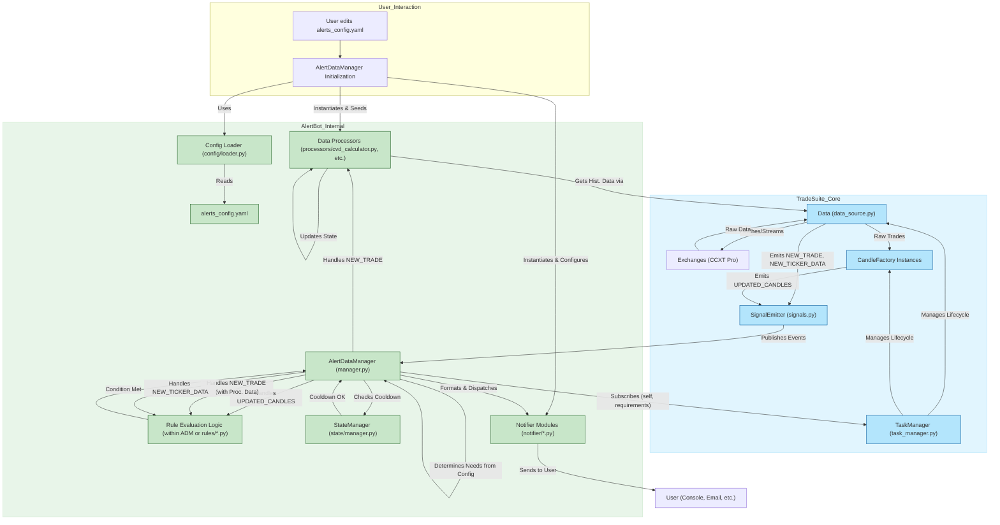

```mermaid
graph TD
    subgraph User_Interaction
        User_Config["User edits alerts_config.yaml"] --> ADM_Init["AlertDataManager Initialization"]
    end

    subgraph TradeSuite_Core
        style TradeSuite_Core fill:#e1f5fe,stroke:#b3e5fc
        TS_Data["Data (data_source.py)"] -- Fetches/Streams --> Internet["Exchanges (CCXT Pro)"]
        TS_TaskManager["TaskManager (task_manager.py)"]
        TS_SignalEmitter["SignalEmitter (signals.py)"]
        TS_CandleFactory["CandleFactory Instances"]
        
        TS_TaskManager -- Manages Lifecycle --> TS_Data
        TS_TaskManager -- Manages Lifecycle --> TS_CandleFactory
    end

    subgraph AlertBot_Internal
        style AlertBot_Internal fill:#e8f5e9,stroke:#c8e6c9
        AB_Config_File["alerts_config.yaml"]
        ADM["AlertDataManager (manager.py)"]
        AB_Loader["Config Loader (config/loader.py)"]
        AB_Processors["Data Processors (processors/cvd_calculator.py, etc.)"]
        AB_RuleLogic["Rule Evaluation Logic (within ADM or rules/*.py)"]
        AB_StateManager["StateManager (state/manager.py)"]
        AB_Notifiers["Notifier Modules (notifier/*.py)"]
    end

    %% Initialization Phase
    ADM_Init -- Uses --> AB_Loader
    AB_Loader -- Reads --> AB_Config_File
    ADM_Init -- Instantiates & Configures --> AB_Notifiers
    ADM_Init -- Instantiates & Seeds --> AB_Processors
    AB_Processors -- Gets Hist. Data via --> TS_Data

    %% Subscription Phase
    ADM -- Determines Needs from Config --> ADM
    ADM -- Subscribes (self, requirements) --> TS_TaskManager

    %% Live Data Flow & Processing
    Internet -- Raw Data --> TS_Data
    TS_Data -- Raw Trades --> TS_CandleFactory
    TS_Data -- Emits NEW_TRADE, NEW_TICKER_DATA --> TS_SignalEmitter
    TS_CandleFactory -- Emits UPDATED_CANDLES --> TS_SignalEmitter
    TS_SignalEmitter -- Publishes Events --> ADM

    ADM -- Handles UPDATED_CANDLES --> AB_RuleLogic
    ADM -- Handles NEW_TRADE --> AB_Processors
    AB_Processors -- Updates State --> AB_Processors
    ADM -- Handles NEW_TRADE (with Proc. Data) --> AB_RuleLogic
    ADM -- Handles NEW_TICKER_DATA --> AB_RuleLogic
    
    %% Alert Triggering & Notification
    AB_RuleLogic -- Condition Met --> ADM
    ADM -- Checks Cooldown --> AB_StateManager
    AB_StateManager -- Cooldown OK --> ADM
    ADM -- Formats & Dispatches --> AB_Notifiers
    AB_Notifiers -- Sends to User --> User_Devices["User (Console, Email, etc.)"]

    %% Styling for clarity
    classDef tradesuite_comp fill:#b3e5fc,stroke:#01579b
    classDef alertbot_comp fill:#c8e6c9,stroke:#1b5e20
    class ADM,AB_Loader,AB_Processors,AB_RuleLogic,AB_StateManager,AB_Notifiers,AB_Config_File alertbot_comp;
    class TS_Data,TS_TaskManager,TS_SignalEmitter,TS_CandleFactory tradesuite_comp;
```